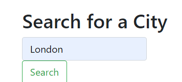
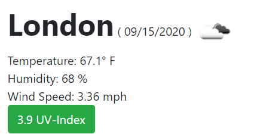
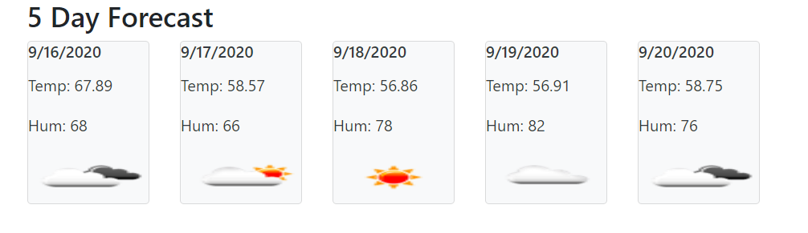

# Check the Weekly Weather

 

When planning the business day, every entrepreneur needs to be prepared for the current and coming days.  Lack of preparation could potentially harm one's business and lose profits. Which ever location the meetings, scoutings or even the quick leasure time will happen, it is always good to be prepared.  This way, it will never be a rainy day.   

 

#

## Table of Contents

~[Purpose](#purpose)
~[Instillation](#instillation)
~[Features](#features)
~[Credits](#credits)

 

## Purpose

#

The purpose of this appliaction is to help the user check the local weather for the city location.  They can input their desired location and have the information returned to them.  This application provides different levels of information for the desired needs of the user.  

 
 

## Instillation

#

**To edit/use the application, please follow the steps to pull the repository from GitHub through Git Bash and pull the script into VSCode, provided all three items are already installed on a local network.**

Instillation steps are as follows:

1. Access the repository at [Git Hub] https://github.com/Napica/HW-06-Weekly-Weather-Dashboard
2. Click on the code section (in green) and clone the SSH key.
3. Once the SSH key is cloned, open the terminal through Git Bash.
4. Find or create the folder the user wants to work in and enter the following commands the the Git terminal:
   1. git clone [copied link] (_this will allow access the repository to the local computer._)
   2. git pull (_this will pull all the lines of script from the local repository._)
   3. code . (_This will extract the code and link the paths to VSCode for review/editing/uploading_)

#### [For Direct Access to GitHub provided application site]

Please click on the link below:

1. https://napica.github.io/HW-06-Weekly-Weather-Dashboard/

 
 

## Features

#

### User can input their desired location

 

 

###  Shows Local Date and Weather
#### This includes the current temperature, current humidity, current wind conditions and current UV-Index

 

 

### User will be given 5 Day Forecast for that seerched location
 

 
 

## Credit

#

I would like to thank the help of my TA's/Tutors/Classmates for the assisstance in making this application possible.
